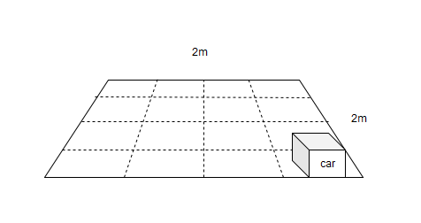

# 2019 Robotics Car Contest

<http://robocar2019.makerobots.eu>

The goal of 2019 robotic car contest is to make robotics accessible to people with little or no experience. If you are already skilled in that field, feel free to join and compete with others. 

In this contest you will create simple robotic car, that could go between different sectors, and indicate in which sector it is now.

Feel free to use lego, vex, fischertechnik, wooden planks, cardboard, tape, your old VHS player and whatever else you have laying around. You could program servo motors with Arduino, or just turn simpler DC motors on and off.

The final round of competition will be held online on September/October 2019. Participants will stream online video of their creations.

# Awards And Prizes

Current prize pool is 50 euro.

# How to participate 

1. Find location that is at least 2x2 metres. Build contest area there. [How to build area](build-area.md).
2. Build car (using retail RC models is not allowed) and take at least 5 photos explaining how it was built. 
3. Submit short video and photos of the your creation to the website/email/github.
4. Compete online during live event (you will have to stream video).

[Need help with building robot?](help.md)

# Submissions

# Rules 

Robot should be 40x40x40 cm max. It should have 4 leds of same color at the top arranged in line or square.

Robot could be remote controlled wireless/wired or be autonomous. 

Leds should indicate on which row it is currently. 

There will be sequence of sectors published at the beginning of live event. 

Example of sequence: 5, 15, 8, 16, 1, 8, 11, 13, 5, 3, 14, 16

Sequence will be ~30-70 numbers, and fastest robot who visit sectors in given order will win. 

Full rules be announced later.

[Allowed streaming platforms](allowed-streaming-platforms.md)

## Deadlines and Important Dates

Full rules will be published in May 2019.

We will start to accept submission in June 2019.

Live event in September/October 2019. Exact date will be known in the middle of August.

# Contacts

Send us message: <robocar2019@makerobots.eu>

Join us in discord: <https://discord.gg/Ch2j84C>

## Want to help?

- Gift a robotic set to the child, and help him to build it.
- Spread the word around. Share that page to people who interested in robotics or want to try. Or just post to your social network.
- Add something to the prize pool. Digitally deliverable content related to robotics or diy would be best. 
- Let us know if you willing to help in some other way.

## Last year competition

Roboarm Online Live Robotics Competition 2018 http://roboarm2019.makerobots.eu

