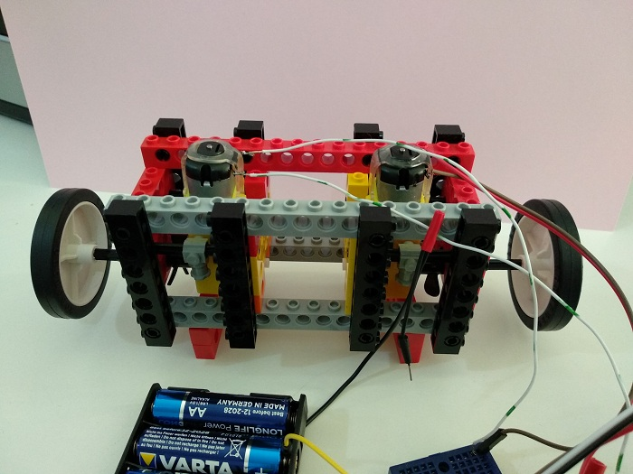
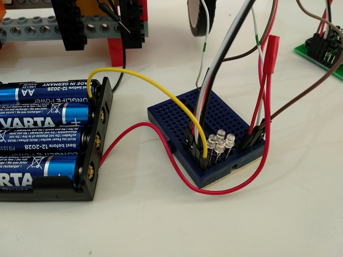
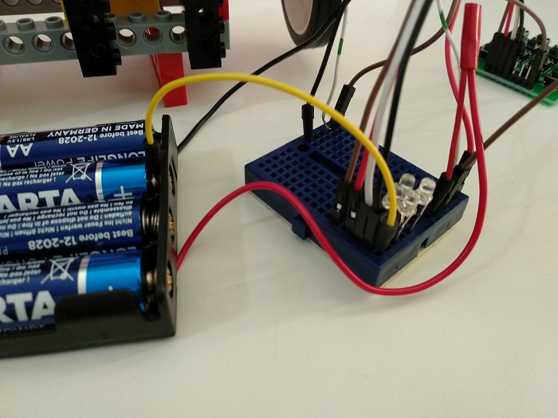
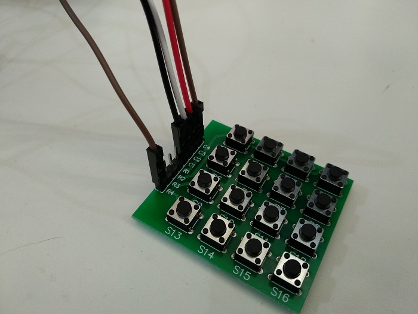
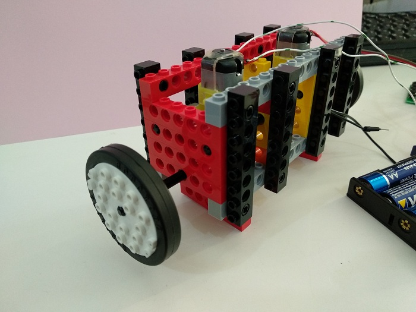
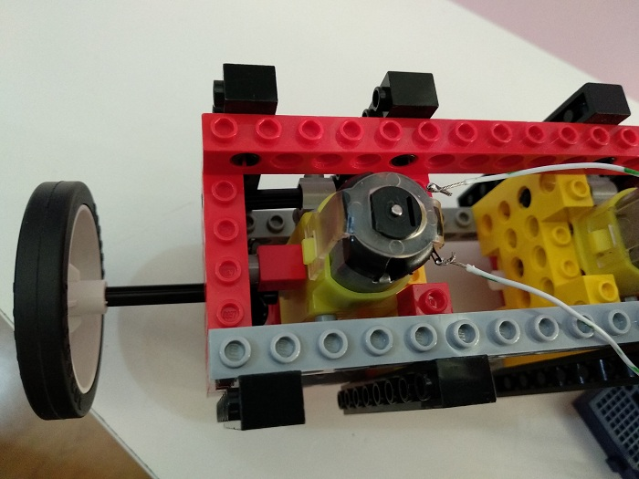
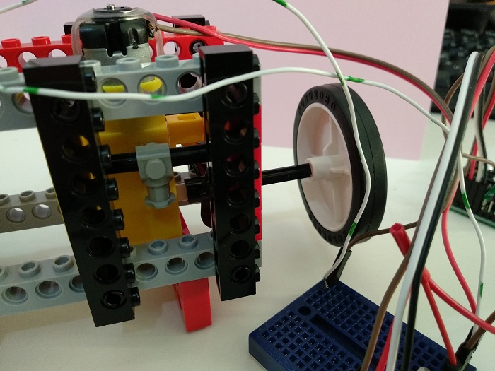
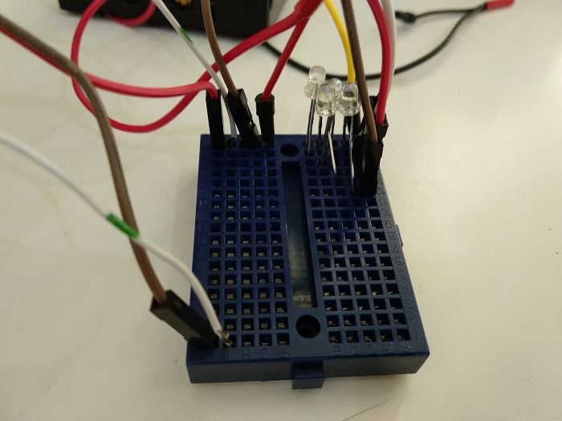
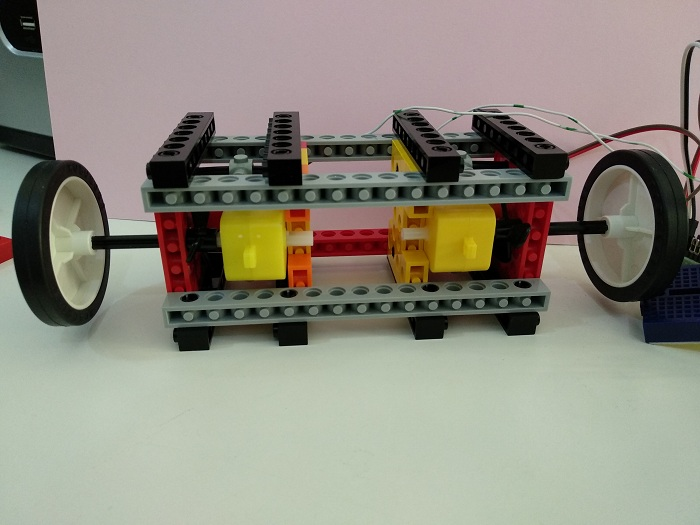
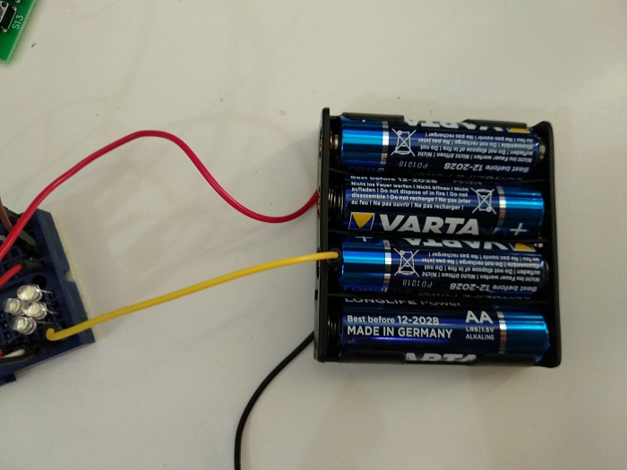

# Fastlong robocar

(email submission)

## Description

Robot's name is: Fastlong.
I have 3v and 6v battery. 4 leds that could be enabled independently. 

## Video

  <iframe
      src="vid1.mp4"
      width="700"
      height="480"
      frameborder="0"
      allowfullscreen="">
  </iframe>

## Images

## Credits

created by: Liubov (l...a@g...m)

